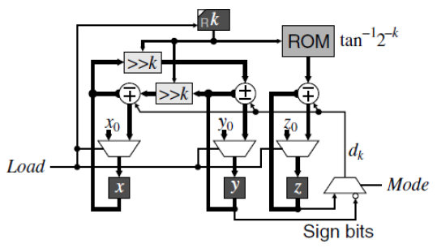
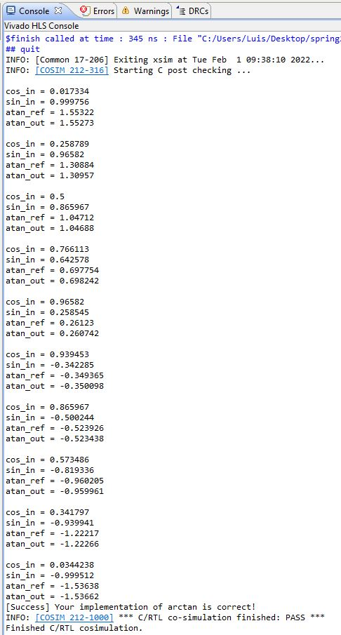
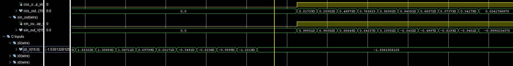
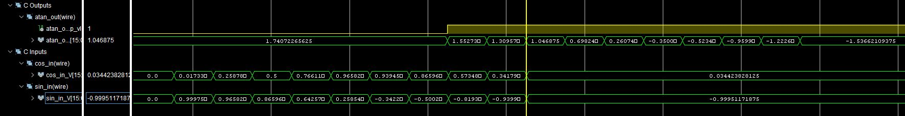

# CORDIC Using Vivado HLS
A CORDIC algorithm implementation using Vivado HLS that can calculate ATAN or COS/SIN.

### test
test

## Description
CORDIC is an acronym for Coordinate Rotation Digital Computer introduced by Volder in 1959. This iterative technique computes multiplicative and similar functions by shift and add operations. It is commonly used in FPGAs where no hardware multiplier is present.
To calculate cos and sin using CORDIC, we can use the following equations:

$$\mathrm{x_{k+1}} = \mathrm{x_{k}} − \mathrm{d_{k}} 2^{−k} \mathrm{y_{k}}$$

$$\mathrm{y_{k+1}} = \mathrm{y_{k}} + \mathrm{d_{k}} 2^{−k} \mathrm{x_{k}}$$

$$\mathrm{z_{k+1}} = \mathrm{z_{k}} − \mathrm{d_{k}} tan^{−1} (2^{-k})$$

$$\text{where }d_{k} = sign(z_{k}) = \begin{Bmatrix}
-1 &  \text{if } z_{k} \lt 0\\
1 & \text{if } z_{k} \ge  0
\end{Bmatrix}$$

As the number of iterations increases, x, y, and z converge to: 

$$x_{k} = G(x_{0}cos(z_{0}) - y_{0}sin(z_{0}))$$

$$y_{k} = G(x_{0}sin(z_{0}) - y_{0}cos(z_{0}))$$

$$z_{k} = 0$$

$$\text{where } G = 1.64676$$

$\text{If we choose } x_{0} \text{ and } y_{0} \text{ properly, we can infer the value of } cos(z_{0}) \text{ and } sin(z_{0}) \text{ from } x_{k} \text{ and } y_{k}\text{.}$

 
 

Similarly, to calculate atan using CORDIC, we can use the following equations:

$$x_{k} = G \sqrt{\mathrm{x_{0}}^{2} + \mathrm{y_{0}}^{2}}$$

$$y_{k} = 0$$

$$z_{k} = z_{0} + tan^{-1}\left( \frac{y_{0}}{x_{0}} \right)$$

$$\text{where } d_{k} = -sign(y_{k})$$

$\text{If we choose } x_{0} \text{, } y_{0} \text{, and } z_{0} \text{ properly, we can infer the value of } tan^{-1}\text{.}$

 
 

Implementing this CORDIC algorithm in hardware results in the following schematic:

## My Results
My CORDIC implementation is tested using 15 iterations.

The following image shows the C/RTL Co-simulation waveforms of the CORDIC COS/SIN and ATAN tests implemented within the basic_cordic_tb.cpp testbench.

cos/sin:

 
 
atan:
