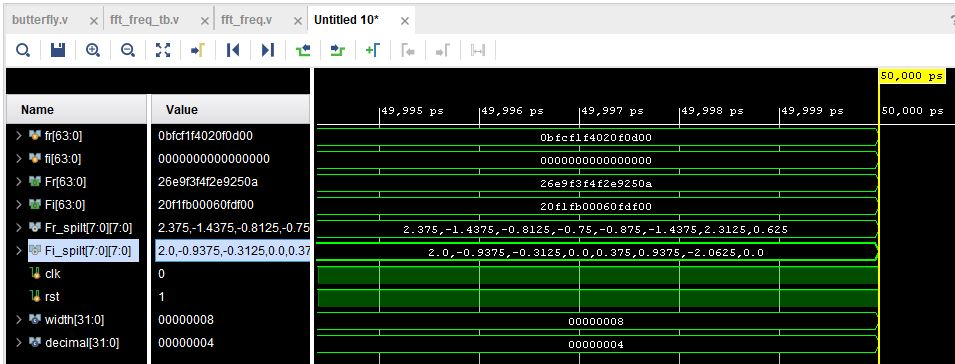

# Discrete Fourier Transform on FPGA

## Description
This DFT design is implemented by performing the radix-2 FFT algorithm. Both decimation in time and decimation in frequency were designed and are located in their corresponding folders. The radix-2 FFT algorithm works by performing butterfly calculations as shown in the following images:

Decimation in time:
 

Decimation in frequency:
 

In both designs, we have 8 8-bit inputs and 8 8-bit outputs.
The "W" is an exponential weighting factor. The radix-2 FFT removes redundant calculations by taking advantage of the periodicity  of this weighting factor. The weighting factor is calculated as such: 

$$\mathrm{W}_{N}^{R} = e^{-j(2\pi R/N)} = cos(2\pi R/N) - jsin(2\pi R/N)$$

$$\text{N: Number of points in the FFT}$$

$$\text{R: Current } \mathrm{W}_{N}^{R} \text{ factor}$$

## My Results
The decimation in time and decimation in frequency designs were first tested through a behavioral simulation with their corresponding testbenches. As indicated in the testbenches, the input signal tests values used were sin(7), sin(6), ..., sin(0). The behavioral simulation waveform results are shown in the following images: 

Decimation in time:
 

Decimation in frequency:
 

The Fr_split and Fi_split signals correspond to the real and imaginary outputs of the simulation. These output values were confirmed to be correct by comparing them to the output values of MATLAB's fft() function as calculated in the included fft_time MATLAB file. The MATLAB file outputs are shown in the following image: 
 

Comparing the waveform simulation Fr_split and Fi_split signals to the first column of the MATLAB "y" matrix output, the differences are negligible, indicating a correct implementation.

Implementation and testing on an FPGA was also performed using their corresponding test files. The results are shown in the following images:

Decimation in time:
 

Decimation in frequency:
 

 

These tests involved three different signals. The first signal being the same one performed in the behavioral testbenches, the second one being a square wave where the first four values are 1 and the second half values are 0, and the third one being a triangle wave.

Again, comparing the outputs to the MATLAB "y" matrix outputs, the negligible differences between the values indicate a correct implementation.
