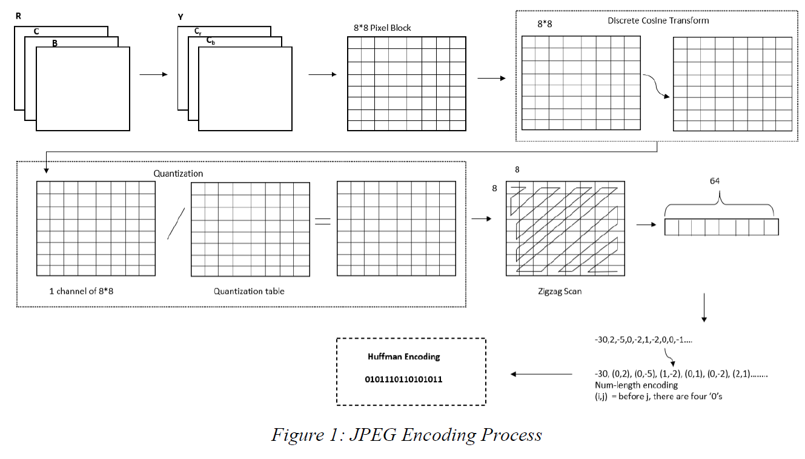
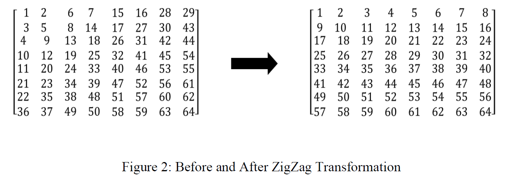

# JPEG Decoder Design on FPGA

This lab involves designing the inverse zigzag transform and Huffman decoding design part of JPEG decoding, all other parts of JPEG decoding were provided. 
## Description

The JPEG encoding process is shown in the following image: 
 

To perform JPEG decoding, the reverse process would need to be performed. 

## Huffman Code Decoding

Usually, Huffman tree is used for encoding and decoding. However, the tree structure is not directly stored in JPEG file and instead, the Huffman table is stored to represent the Huffman coding information.

The Huffman table only contains how many codes there are, for each code length. For example, assume
there are 6 Huffman codes: 00, 01, 100, 101, 110, 111, then, the Huffman table only records: 2 codes of
length 2, 4 codes of length 3. However, given such a Huffman table, there is only 1 valid Huffman
encoding according to it, and thus, only 1 Huffman tree that satisfies the Huffman table.

Besides Huffman table, JPEG file also records the symbols that each code represents. In the above
example, since there are 6 codes, there are also 6 symbols. If they are “1”, “12”, “205”, “36”, “21,” and
“75” accordingly, then, if the code is 1101001, the result should be “21”, “205”. (The rest of the code ‘1’ is ignored because it can’t be decoded as Huffman code)

Exploiting the uniqueness of the Huffman tree and correlating a symbol to each code is how the Huffman encoding algorithm encodes and compresses data.

### huffmandecode.v

In “huffmandecode.v”, there is one 16-bit data to be decoded at the input port code. The Huffman
decoding should decode from the highest bits of code and output the first decoded data to output data.
There are 16 data elements at the input port hufftable, with each data consisting of 8 bits. The nth 8-bit
data represents how many codes of length n are there. For example, if hufftable[31:24]=5, it means
there are 5 codes of length 4. There are 256 data elements at the input port huffsymbol, with each data
consisting of 8 bits. The nth 8-bit data represents the decoded data of the nth Huffman code.

huffmandecode.v satisfies the following:

a) When rst is 0, finish is set to 0.

b) When rst is 1, the module starts calculating.

c) The decode data is finally placed at the output port data. The length that decoded this data is put
at output port length.

d) When the data and length are ready, finish is set to 1, and data, length and finish hold their values.

## Inverse Zigzag Transform

The zigzag transform is described by the following image:
 

For the original 8*8 block, each number in the image above represents the position in the zigzag block
(the position is counted from the left to the right of each row, and from the upmost row to the bottom
row). For example, the data at row 2 column 3 in the original block is put at the 8th position in the
zigzag block (which is at row 1 column 8). To do the inverse zigzag transform, the reverse is performed.

### izigzag.v

In “izigzag.v”, there are 64 data elements at the input port zigzag, with each data element having 32
bits. The first data is put at the lowest 32 bits of zigzag, and the last data is put at the highest 32 bits.

izigzag.v satisfies the following:

a) When rst is 0, finish is set to 0.

b) When rst is 1, the module starts calculating.

c) The rearranged data is finally put at the output port outdata. The first data is put at the lowest 32
bits of outdata, and the last data is assigned to the highest 32 bits.

d) When the outdata is ready, finish is set to 1, and both outdata and finish hold their values.
