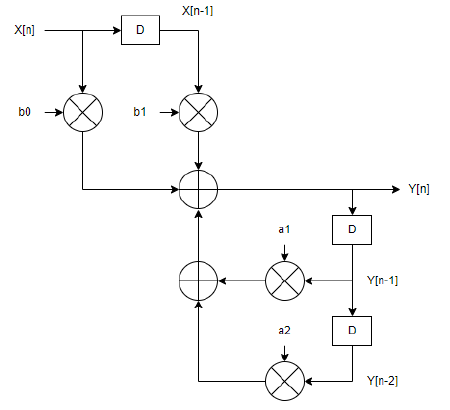
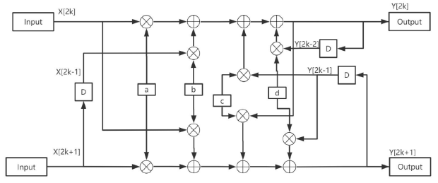

# Unfolded IIR Filter

## Infinite Impulse Response (IIR) Filter
The Infinite Impulse Response (IIR) filter is a discrete-time filter and a class of digital filters. Filters are mainly used to alter the frequency component of the time signals by either reducing or amplifying the magnitude of certain frequencies.
The output of IIR filters is based on both past inputs and previous outputs. The IIR is recursive in nature, as its filters use part of the outputs as inputs. Consequently, IIR is not always computationally stable.

### IIR Filter Calculation
For an IIR filter with p and q orders, the general equation is defined below.
$$y[n] = \sum_{k = 0}^{p} b_{k}x[n-k]+\sum_{k=1}^{q} a_{k}y[n-k]$$

The following image shows a simple IIR filter with p=1 and q=2:

## Unfolding
Unfolding is a transformation technique that increases the throughput of a digital signal processing program by duplicating the functional blocks while maintaining functionality.
The following image shows the unfolded version of the IIR filter describing two iterations of the original design:

# Files

### IIR_unfold.v
This is my unfolded IIR filter design.

Eight multiply modules are instatiated with the inputs to the filter. These modules correspond to the eight multiplications shown in the image above. 

The multiplication outputs are wired together with additions according to the image above to produce the filter outputs.

The delayed signals shown within the design shown in the image above are clock-controlled within an always block.
### multiply.v
Multiplication module that multiplies two 8-bit signed fixed-point numbers with 4 bits for the fractional part. This module is used for the multiplication within the IIR filter calculation.

### IIR_unfold_tb.v
This is my unfolded IIR filter design testbench.

The input to the design are:
a = 8

b = -24

c = 32

d = -16

which are in Q(3,4) notation.

### ref_IIR.py

### top_IIR_unfold.v

### lab3_IIR_unfold_test

